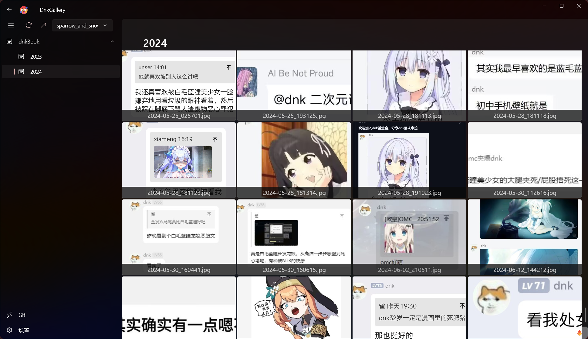
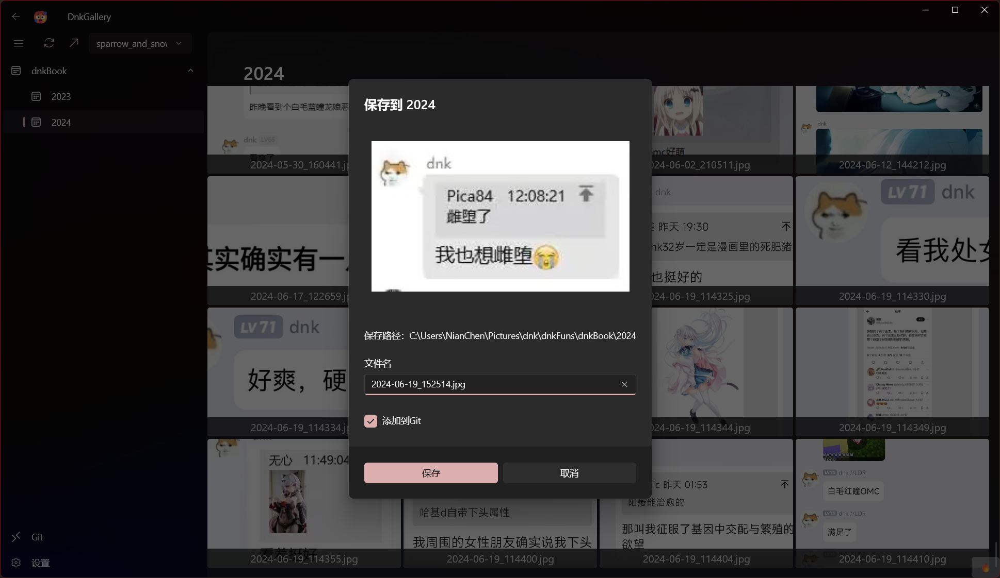
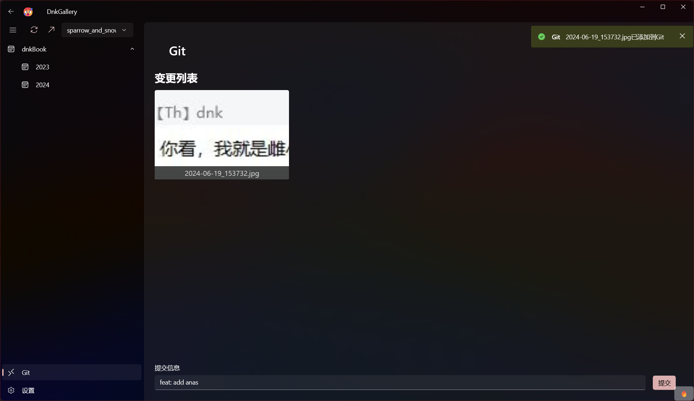
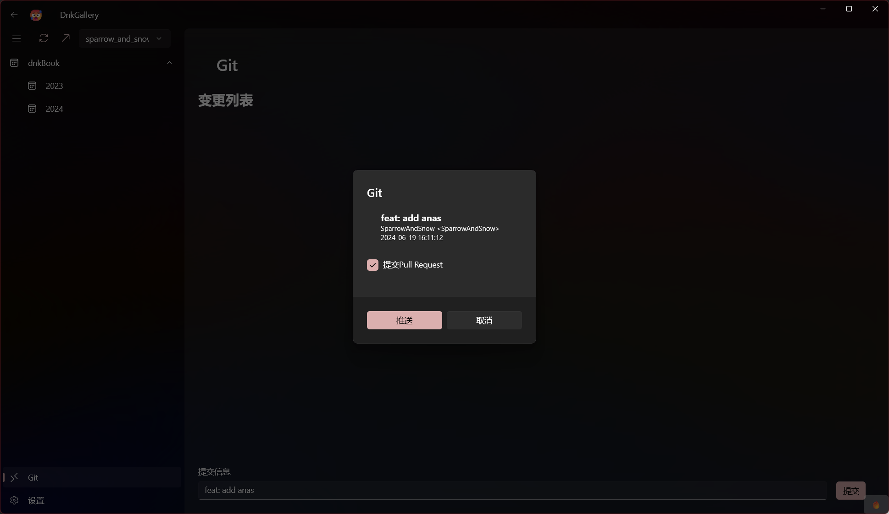

# DnkGallery
<a href="https://github.com/DnkBook/dnkFuns" target="_blank">dnk语录</a>，记录dnk傲娇每一刻

### Platform
- [x] Windows
- [ ] MacOS
- [ ] Android
- [ ] IOS

### 基本设置

Local使用本地地址

Git从远程仓库获取，并且缓存到本地地址（一定要设置本地地址）

Remote TODO

### Git设置

Git用户名

<a href="https://github.com/settings/tokens"  target="_blank">Git Access Token</a>

### 操作

同步按钮：拉取同步远程最新语录，没本地仓库时会自动创建前提是设置了本地地址
推送按钮：推送已提交的变更，如勾选提交 <b>Pull Request</b> 将自动创建pr
分支选择：分支选择框，编辑模式时输入分支名回车会创建分支
1. 对着dnk发癫消息截图

2. 选中左侧目录，例如 <b>2024</b> 进行粘贴

文件名自动生成符合dnkBook的格式

3. 点击保存保存到本地，如勾选添加到Git侧边栏显示待提交语录

4. 输入提交信息，选择分支并提交

5. 点击推送按钮推送到远程仓库
